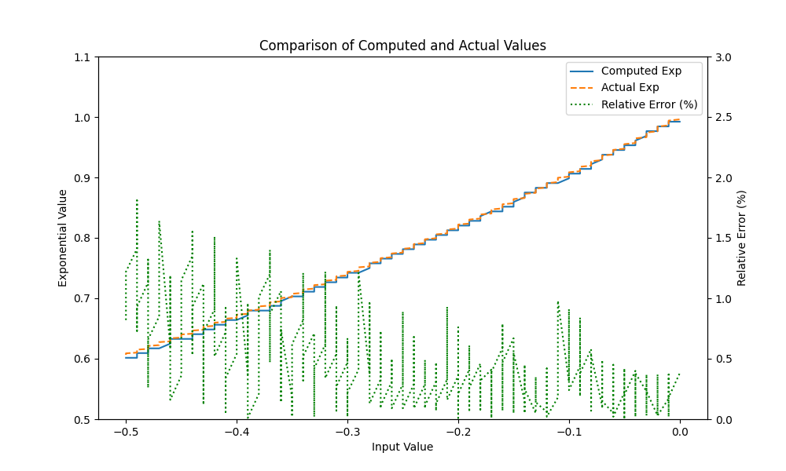

# Fixed Point EXP in Chisel 6.2

Implementation of exp(x) in [I-BERT: Integer-only BERT Quantization](https://arxiv.org/abs/2101.01321)

```shell
mill Exp.test.testOnly  exp.FixedPointExpTest
```



# Oops

[Fixed Point Arithmetic](https://github.com/ucb-bar/fixedpoint) is implemented in Chisel 5.1, migrate to Chisel 6.2 by modifying the following code in `FixedPoint.scala`

```
// import chisel3.internal.firrtl.{KnownWidth, UnknownWidth, Width}
import chisel3.{KnownWidth, UnknownWidth, Width}
```